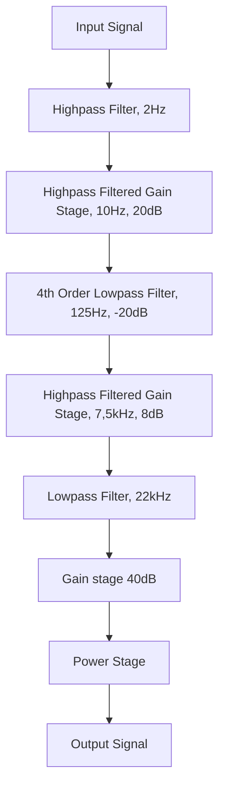

## Highpass Filter

### Calculating Values

The highpass filter is designed to filter out unwanted frequencies, specifically those between 20-20kHz, which are outside the audible range. Since this is a highpass filter, we focus on the lower end of the spectrum. A common practice is to set the cutoff frequency ($f_C$) at about 1/10th of the minimum frequency of interest:

$$
f_{C} = \frac{20 \text{Hz}}{10} = 2 \text{Hz}
$$

Given:
- Resistor value: $R = 47 \text{k}\Omega$
- Desired cutoff frequency: $f_{C} = 2 \text{Hz}$

The capacitance ($C$) is calculated as:

$$
C = \frac{1}{2\pi R f_{C}} \approx 1.69 \mu F
$$

In this project, components from the E12 series will be used. Therefore, $C$ is rounded to the nearest standard value:

$$
C = 1.8 \mu F
$$

#### Verifying the Cutoff Frequency

Recalculate $f_C$ with the chosen capacitor:

$$
f_{C} = \frac{1}{2\pi RC} \approx 1.88 \text{Hz}
$$

This value is still within an acceptable range.

### Final Component Values

- **Resistor (R):** $47 \text{k}\Omega$
- **Capacitor (C):** $1.8 \mu F$
- **Cutoff Frequency ($f_{C}$):** $1.88 \text{Hz}$

### Angular Frequency and Reactance

- Angular frequency: $\omega = 2\pi f$
- Reactance of the capacitor: $X_{C} = \frac{1}{\omega C}$

### Output Voltage Formula

The output voltage ($V_{out}$) is given by:

$$
V_{out} = V_{in} \times \frac{R}{\sqrt{X_{C}^2 + R^2}}
$$

### Impedance of the Capacitor

The impedance of the capacitor is calculated as:

$$
Z_{C} = \frac{1}{j\omega C}
$$

### Voltage Transfer Equation

The voltage transfer equation is:

$$
V_{out} = V_{in} \times \frac{R}{R + \frac{1}{j\omega C}}
$$

### Simplifying the Expression

Simplifying the transfer function:

$$
V_{out} = V_{in} \times \frac{R}{R\left( 1 + \frac{1}{j\omega C} \right)} = V_{in} \times \frac{R}{1 + \frac{1}{j\omega C}} = V_{in} \times \frac{j\omega RC}{1 + j\omega RC}
$$

### Final Transfer Function

The final transfer function ($H(j\omega)$) is:

$$
H(j\omega) = \frac{V_{out}}{V_{in}} = \frac{j\omega RC}{1 + j\omega RC} = \frac{j\omega \tau}{1 + j\omega \tau}
$$

Where $\tau = RC$.

### Second order filter

Since this circuit is using the same values as the filter discussed earlier it is equivalent to having two first order filters back to back. Because of this the Transfer Function can be multiplied by 2.

### Second order Transfer Function

$$
H(j\omega)=2*\frac{j\omega \tau}{1+j\omega \tau}=\frac{2j\omega \tau}{1+j\omega \tau}
$$
